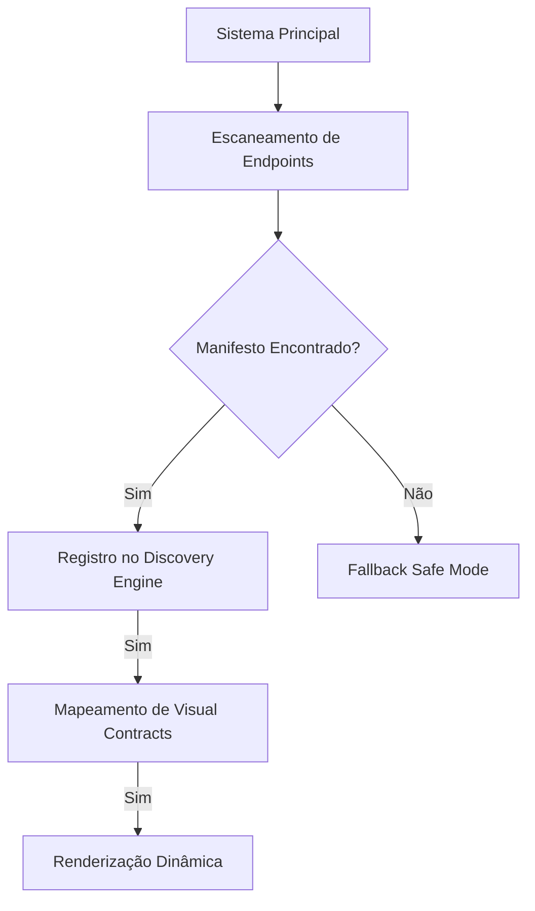

# 🌌 Sarak Matrix Matrix v6.5: Arquitetura Atômica

Bem-vindo à documentação oficial da **Sarak-Lib-UI-Core**. Este módulo é o coração visual do ecossistema Sarak, projetado para ser o motor de renderização agnóstico que unifica todos os microsserviços.

## 1. O Conceito "Agnostic Discovery"

Diferente de sistemas legados onde o Frontend conhece todos os módulos em tempo de compilação, a Sarak Matrix utiliza **Descoberta Dinâmica**.

- **O Core é Cego:** A UI-Core não sabe quais módulos existem (Catalog, Orchestrator, etc.) até que o sistema seja inicializado.
- **Manifestos como Identidade:** Cada módulo carrega um arquivo de manifesto que "explica" para o Core quem ele é e o que ele pode fazer.
- **Roteamento Automático:** O sistema gera menus, abas e rotas dinamicamente baseando-se apenas nos manifestos descobertos.

## 2. Soberania Atômica

Cada biblioteca no ecossistema Sarak é desenhada para ser **Soberana**.

- **Isolamento de Backend:** Cada módulo fala com seu próprio backend e seu próprio schema de banco de dados.
- **Independência Visual:** Graças ao **Design Engine v10**, um módulo pode ser testado de forma isolada e ainda assim garantir que, quando integrado ao portal principal, ele herdará instantaneamente todas as configurações de tema globais.

## 3. O Fluxo de Renderização

## 4. Filosofia de Código: "Manifest-First"

Nesta arquitetura, **diminuímos o volume de código frontend customizado** em favor de descritores JSON (Manifestos). Se você pode descrever uma tela em um manifesto, você não deve criar um novo componente `.tsx`. Isso garante manutenção centralizada e consistência visual absoluta.

---
[Próxima Parada: Design Engine v10](./1-design-engine-v10.md)
